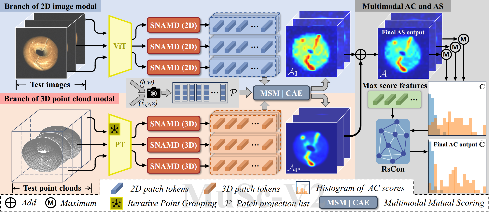

# ✨MuSc-V2 (TPAMI 2026)✨

**This is an official PyTorch implementation for "MuSc-V2: Zero-Shot Multimodal Industrial Anomaly Classification and Segmentation with Mutual Scoring of Unlabeled Samples"**

Authors:  [Xurui Li](https://github.com/xrli-U)<sup>1</sup> | [Feng Xue](https://xuefeng-cvr.github.io/)<sup>2</sup> | [Yu Zhou](https://github.com/zhouyu-hust)<sup>1</sup>

Institutions: <sup>1</sup>Huazhong University of Science and Technology | <sup>2</sup>University of Trento

### 🧐 Paper: [IEEE](https://ieeexplore.ieee.org/abstract/document/11498451) | [Arxiv](https://arxiv.org/abs/2511.10047)


## <a href='#all_catelogue'>**Go to Catalogue**</a>


## 📣News:
**[*04/27/2026*]**
- 📤The complete and reproducible code for MuSc-V2 is released.

**[*04/24/2026*]**
- 🎉🎉🎉Great News! Our MuSc-V2 has been accepted to **TPAMI 2026** !

**[*11/14/2025*]**
- 😋Our MuSc-V2​ paper is available on [Arxiv](https://arxiv.org/abs/2511.10047).
- 🦾This is an extended version of the original conference paper "MuSc: Zero-Shot Industrial Anomaly Classification and Segmentation with Mutual Scoring of the Unlabeled Images", which was published at ICLR 2024.
- The code for the original MuSc​ could be found in the separate repository: [https://github.com/xrli-U/MuSc](https://github.com/xrli-U/MuSc).

<span id='all_catelogue'/>

## 📖Catalogue

* <a href='#abstract'>1. Abstract</a>
* <a href='#setup'>2. Environment setup</a>
* <a href='#datasets'>3. Datasets download</a>
  * <a href='#datatets_mvtec3d'>MVTec 3D-AD</a>
  * <a href='#datatets_eyecandies'>Eyecandies</a>
* <a href='#run_musc'>4. Run MuSc-V2</a>
* <a href='#results_datasets'>5. Detailed results</a>
* <a href='#citation'>6. Citation</a>
* <a href='#license'>7. License</a>

<span id='abstract'/>

## 👇Abstract: <a href='#all_catelogue'>[Back to Catalogue]</a>

Zero-shot anomaly classification (AC) and segmentation (AS) methods aim to identify and outline defects without using any labeled samples. In this paper, we reveal a key property that is overlooked by existing methods: normal image patches across industrial products typically find many other similar patches, not only in 2D appearance but also in 3D shapes, while anomalies remain diverse and isolated.

To explicitly leverage this discriminative property, we propose a Mutual Scoring framework (**MuSc-V2**) for zero-shot AC/AS, which flexibly supports single 2D/3D or multimodality. Specifically, our method begins by improving 3D representation through Iterative Point Grouping (IPG), which reduces false positives from discontinuous surfaces. Then we use Similarity Neighborhood Aggregation with Multi-Degrees (SNAMD) to fuse 2D/3D neighborhood cues into more discriminative multi-scale patch features for mutual scoring. The core comprises a Mutual Scoring Mechanism (MSM) that lets samples within each modality to assign score to each other, and Cross-modal Anomaly Enhancement (CAE) that fuses 2D and 3D scores to recover modality-specific missing anomalies. Finally, Re-scoring with Constrained Neighborhood (RsCon) suppresses false classification based on similarity to more representative samples.

Our framework flexibly works on both the full dataset and smaller subsets with consistently robust performance, ensuring seamless adaptability across diverse product lines. In aid of the novel framework, MuSc-V2 achieves significant performance improvements: a **+23.7%** AP gain on the MVTec 3D-AD dataset and a **+19.3%** boost on the Eyecandies dataset, surpassing previous zero-shot benchmarks and even outperforming most few-shot methods.


 

<span id='setup'/>

## 🎯Setup: <a href='#all_catelogue'>[Back to Catalogue]</a>

### Environment:

- Python 3.8
- CUDA 11.7
- PyTorch 2.0.1

Clone the repository locally:

```
git clone https://github.com/HUST-SLOW/MuSc-V2.git
```

Create virtual environment:

```
conda create --name muscv2 python=3.8
conda activate muscv2
```

Install the required packages:

```
pip install torch==2.0.1 torchvision==0.15.2 torchaudio==2.0.2
pip install -r requirements.txt
pip install "git+git://github.com/erikwijmans/Pointnet2_PyTorch.git#egg=pointnet2_ops&subdirectory=pointnet2_ops_lib"
```

<span id='datasets'/>

## 👇Datasets Download: <a href='#all_catelogue'>[Back to Catalogue]</a>

Put all the datasets in `./data` folder.

<span id='datatets_mvtec3d'/>

### [MVTec 3D-AD](https://www.mvtec.com/research-teaching/datasets/mvtec-3d-ad)

```
data
|---mvtec_3d
|-----|-- bagel
|-----|-----|----- calibration
|-----|-----|----- test
|-----|-----|----- train
|-----|-----|----- validation
|-----|-- cable_gland
|-----|--- ...
```

<span id='datatets_eyecandies'/>

### [Eyecandies](https://eyecan-ai.github.io/eyecandies/download)

```
data
|----eyecandies
|-----|-- CandyCane
|-----|-----|--- test_private
|-----|-----|--- test_public
|-----|-----|--- train
|-----|-----|--- val
|-----|-- ChocolateCookie
|-----|--- ...
```

These dataset should be preprocessed as follow,

```
python ./datasets/mvtec3d_preprocessing.py
python ./datasets/eyecandies_preprocessing.py
```

<span id='run_musc'/>

## 💎Run MuSc-V2: <a href='#all_catelogue'>[Back to Catalogue]</a>

We provide two ways to run our code.

### python

```
python examples/muscv2_main.py
```
Follow the configuration in `./configs/muscv2.yaml`.

### script

```
bash scripts/muscv2.sh
```
The configuration in the script `muscv2.sh` takes precedence.

The key arguments of the script are as follows:

- `--device`: GPU_id.
- `--data_path`: The directory of datasets.
- `--dataset_name`: Dataset name.
- `--class_name`: Category to be tested. If the parameter is set to `ALL`, all the categories are tested.
- `--backbone_name`: This parameter defines the modality of data used for feature extraction. (1)*'dino_vitbase8'*: Using only 2D modal data. (2)*'point-mae'*: Using only 3D modal data. (3)*'dino_vitbase8' 'point-mae'*: Using both 2D and 3D multimodal data​. More details see `./scripts/muscv2.sh`.

- `--feature_layers`: The layers for extracting features in backbone.
- `--img_resize`: The size of the image inputted into the model.
- `--r_list`: The aggregation degrees of our SNAMD module.
- `--output_dir`: The directory that saves the anomaly prediction maps and metrics. This directory will be automatically created.
- `--vis`: Whether to save the anomaly prediction maps.
- `--vis_type`: Choose between *single_norm* and *whole_norm*. This means whether to normalize a single anomaly map or all of them together when visualizing.
- `--save_excel`: Whether to save anomaly classification and segmentation results (metrics).


<span id='results_datasets'/>

## 🎖️Detailed results: <a href='#all_catelogue'>[Back to Catalogue]</a>

All the results are implemented by the default settings in our paper.

### MVTec 3D-AD

|  Category  | AUROC-cls | F1-max-cls | AP-cls | AUROC-segm | F1-max-segm | AP-segm | PRO-segm |
| :--------: | :-------: | :--------: | :----: | :--------: | :---------: | :-----: | :------: |
|   Bagel    |   96.13   |    96.17   |  98.96 |   99.68    |    65.98    |  71.05  |  98.75   |
| Cable_gland|   73.89   |    89.23   |  93.28 |   97.28    |    38.03    |  32.03  |  91.94   |
|   Carrot   |   97.11   |    96.99   |  99.37 |   99.84    |    59.98    |  58.02  |  99.37   |
|   Cookie   |   83.77   |    90.75   |  95.44 |   97.51    |    60.28    |  64.53  |  94.54   |
|   Dowel    |   79.40   |    90.00   |  94.57 |   97.56    |    37.05    |  31.33  |  92.17   |
|   Foam     |   85.44   |    91.76   |  95.85 |   99.28    |    49.35    |  48.19  |  96.91   |
|   Peach    |   93.47   |    93.95   |  98.34 |   99.76    |    61.39    |  65.79  |  99.05   |
|   Potato   |   86.02   |    92.93   |  96.30 |   99.89    |    59.94    |  63.60  |  99.53   |
|   Rope     |   97.60   |    96.30   |  99.09 |   99.79    |    64.92    |  66.04  |  98.81   |
|   Tire     |   87.95   |    91.53   |  96.49 |   99.68    |    48.88    |  46.39  |  98.73   |
| **Average**|   88.08   |    92.96   |  96.77 |   99.03    |    54.58    |  54.70  |  96.98   |

### Eyecandies

|           Category           | AUROC-cls | F1-max-cls | AP-cls | AUROC-segm | F1-max-segm | AP-segm | PRO-segm |
| :--------------------------: | :-------: | :--------: | :----: | :--------: | :---------: | :-----: | :------: |
|         CandyCane         |   46.56   |    66.67   |  50.63 |   97.26    |     3.56    |   1.78  |  90.74   |
|     ChocolateCookie      |   90.40   |    84.44   |  92.47 |   98.35    |    48.93    |  42.55  |  91.79   |
|    ChocolatePraline     |   92.64   |    90.20   |  94.17 |   96.11    |    56.97    |  54.79  |  86.67   |
|         Confetto         |   99.68   |    97.96   |  99.70 |   99.76    |    60.87    |  65.76  |  99.20   |
|        GummyBear         |   87.66   |    80.85   |  89.59 |   95.77    |    39.48    |  32.93  |  87.65   |
|      HazelnutTruffle     |   71.52   |    68.85   |  79.01 |   94.44    |    42.63    |  32.89  |  73.27   |
|    LicoriceSandwich     |   87.20   |    82.35   |  90.14 |   97.29    |    40.75    |  35.22  |  88.93   |
|         Lollipop         |   67.83   |    64.00   |  68.11 |   98.39    |    28.28    |  23.19  |  91.75   |
|       Marshmallow        |   96.64   |    95.83   |  97.97 |   99.21    |    69.58    |  72.91  |  95.12   |
|     PeppermintCandy      |   99.20   |    97.96   |  99.33 |   98.83    |    55.47    |  55.50  |  95.98   |
|           **Average**           |   83.93   |    82.91   |  86.11 |   97.54    |    44.65    |  41.75  |  90.11   |

### Download Links
We also provide download links to anomaly maps (greyscale map) output by our MuSc-V2 below.

Datasets | MVTec 3D-AD | MVTec 3D-AD | MVTec 3D-AD | Eyecandies | Eyecandies | Eyecandies |
| :---:     |   :---:    |  :---: |  :---:  |  :---:  |  :---:  |  :---:  |
Modalities | Only 2D | Only 3D | 2D+3D | Only 2D | Only 3D | 2D+3D |
Google | [drive](https://drive.google.com/file/d/1Q-Dz7UrGC8N5hZaeWNJyZX4ZYbU0B8Cb/view?usp=sharing) | [drive](https://drive.google.com/file/d/1B-omDD0Qkb0IQNOGhBhUDlkkH5T3ZaWj/view?usp=sharing) | [drive](https://drive.google.com/file/d/1ZDRpDzPybS2HzEeKSxVAt-UUzS6nQLD1/view?usp=sharing) | [drive](https://drive.google.com/file/d/11SodZsEGHmDRMFfhBR5P4OfgT3CxIuWd/view?usp=sharing) | [drive](https://drive.google.com/file/d/1dMw8eCAbuIQEh5OBFMNA0C0TVl3bHwAe/view?usp=sharing) | [drive](https://drive.google.com/file/d/1YCpCoA7tvS0ItA_6i2VvEXrXQ41IHXY4/view?usp=sharing) |
Baidu | [drive](https://pan.baidu.com/s/1gEa46-QR8F0g2EUPNDXsxA?pwd=0721) | [drive](https://pan.baidu.com/s/18byLputb2X34KxvmoVflag?pwd=0721) | [drive](https://pan.baidu.com/s/1uRa1LCK_Uxq9icgCCfB0-w?pwd=0721) | [drive](https://pan.baidu.com/s/1gm2fcilYvih3ItnHjgNT4A?pwd=0721) | [drive](https://pan.baidu.com/s/1-04xPHJXWcpMjpftrN2FEw?pwd=0721) | [drive](https://pan.baidu.com/s/1qxQ01ZdVGGo1y7Fh8NULPw?pwd=0721) |

<span id='citation'/>

## Citation: <a href='#all_catelogue'>[Back to Catalogue]</a>
### MuSc-V2:
```
@ARTICLE{Li2026MuScV2,
  author={Li, Xurui and Xue, Feng and Zhou, Yu},
  journal={IEEE Transactions on Pattern Analysis and Machine Intelligence}, 
  title={MuSc-V2: Zero-Shot Multimodal Industrial Anomaly Classification and Segmentation with Mutual Scoring of Unlabeled Samples}, 
  year={2026},
  pages={1-14},
  doi={10.1109/TPAMI.2026.3688174}}
```
### MuSc:
```
@inproceedings{Li2024MuSc,
  title={MuSc: Zero-Shot Industrial Anomaly Classification and Segmentation with Mutual Scoring of the Unlabeled Images},
  author={Li, Xurui and Huang, Ziming and Xue, Feng and Zhou, Yu},
  booktitle={International Conference on Learning Representations},
  year={2024}
}
```


<span id='license'/>

## License: <a href='#all_catelogue'>[Back to Catalogue]</a>
MuSc-V2 is released under the **MIT Licence**, and is fully open for academic research and also allow free commercial usage. To apply for a commercial license, please contact yuzhou@hust.edu.cn.
